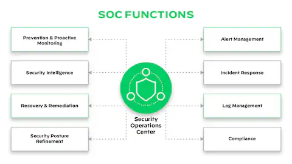
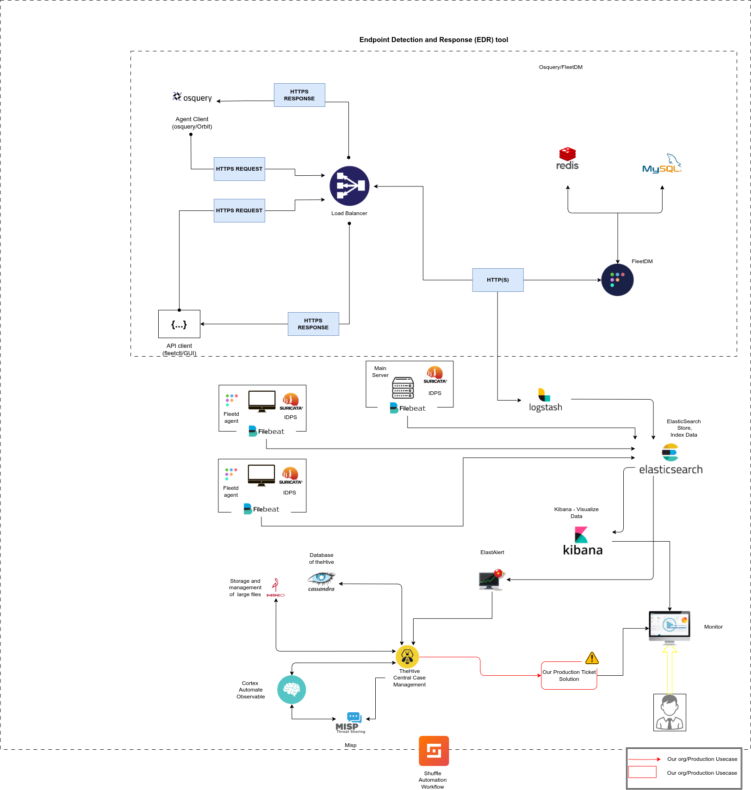

# Open-Source Security Operations Center (SOC)

### About This Project

This project was developed as part of my Bachelor's thesis. It represents a significant effort to create a comprehensive, open-source solution for cybersecurity operations, making advanced security tools accessible to a broader audience.

### Project Goal

The primary objective of this project is to develop a fully operational Security Operations Center (SOC) using open-source tools. The goal is to containerize these tools, enabling users to deploy the entire SOC with a single click. By leveraging Docker, this project ensures seamless deployment across various environments, making the SOC portable and easy to use.

### What is a SOC?

A Security Operations Center (SOC) is a centralized unit within an organization responsible for monitoring, detecting, analyzing, and responding to cybersecurity incidents. It acts as the nerve center for a company's cybersecurity efforts, combining people, processes, and technology to safeguard the organization's assets from cyber threats. SOC teams utilize various tools and techniques to continuously monitor networks, systems, and applications for malicious activity, playing a vital role in mitigating and remediating security incidents.

  

### Architecture Diagram

  

> [!Warning]
>
> This project involves the use of multiple Docker images, each requiring substantial computational resources for optimal performance. If your system does not have sufficient resources (CPU, RAM, and storage), there is a risk of instability or crashes. It is strongly recommended to ensure your system meets the necessary resource requirements before deploying these images.

Thank you for visiting! Feel free to explore the repository and contribute to the project.
