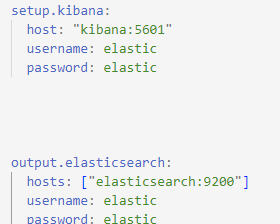
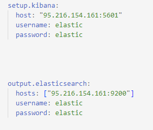

# Filebeat Windows Installation

This guide provides step-by-step instructions for installing and configuring Filebeat 7.17 on Windows. Filebeat is a lightweight shipper for forwarding and centralizing log data. Once installed, you can specify the location of your log files and visualize the log data in Kibana.

Table of Contents

1. [Install Filebeat](#step-1-install-filebeat)
2. [Configure Filebeat](#step-2-configure-filebeat)
3. [Start Filebeat](#step-3-start-filebeat)

## Step 1: Install Filebeat
    
1. Download Filebeat
Download the Filebeat Windows zip file from the [official downloads page](https://www.elastic.co/downloads/beats/filebeat).
2. Extract the Zip File
Extract the contents of the zip file into C:\Program Files.
3. Rename the Directory
Rename the filebeat-<version>-windows directory to Filebeat.
4. Open PowerShell as Administrator
Open a PowerShell prompt as an Administrator by right-clicking the PowerShell icon and selecting "Run As Administrator".
5. Install Filebeat as a Windows Service
Run the following commands from the PowerShell prompt to install Filebeat as a Windows service:
cd “C:\Program Files\Filebeat”
 .\install-service-filebeat.ps1
If script execution is disabled on your system, you need to set the execution policy for the current session to allow the script to run:
PowerShell.exe -ExecutionPolicy UnRestricted -File .\install-service-filebeat.ps1

## Step 2: Configure Filebeat

1. Copy Configuration File
Replace the filebeat.yml configuration file from the provided path to the Filebeat installation directory:

        Source: ./S.O.C./Installation/endpoints/windows/filebeat.yaml
        Destination: C:\Program Files\Filebeat\filebeat.yml

Ensure that you have the administrator privileges while you do this .

## Step 3: Start Filebeat
    
1. Modify User Credentials

Before starting Filebeat,we will edit the filebeat.yaml file  and replace the hosts with the server host IP of Kibana and Elasticsearch

Where if the IP of Kibana and Elasticsearch is  for example 95.216.154.161 then we will replace the Elasticsearch and Kibana hostnames with the below:

 

                                    
2. Start the Filebeat Service

Start the Filebeat service using the following command:

    PS C:\Program Files\Filebeat> Start-Service filebeat

By default, Windows log files are stored in C:\ProgramData\filebeat\Logs.

Filebeat should now begin streaming events to Elasticsearch. You can visualize these events in Kibana and use them for monitoring and analysis. 

You can find also the official installation [here](https://www.elastic.co/guide/en/beats/filebeat/7.17/filebeat-installation-configuration.html#set-connection) .
