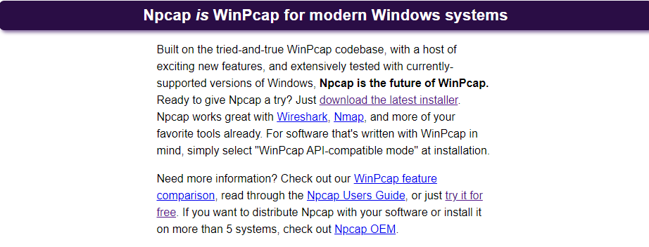
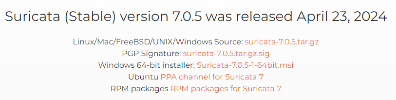
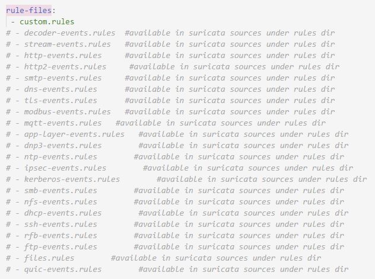
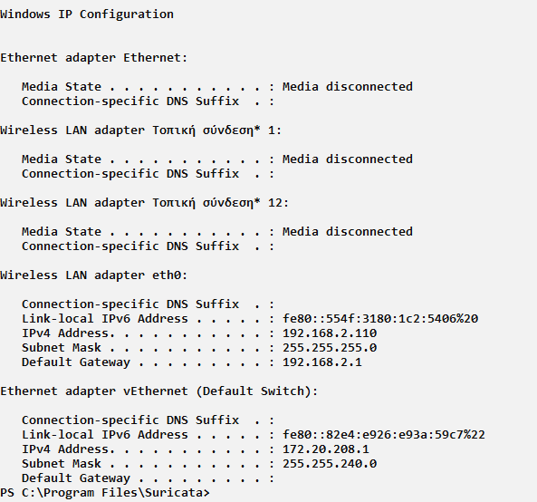
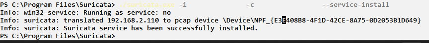

## Suricata Windows Installation

### 1. Install Npcap

Npcap is a packet capture library for Windows. Suricata relies on this library to capture network packets in real-time. Without Npcap, Suricata would not be able to inspect network traffic.

   (a) Go to the Npcap website: [Npcap Download](https://npcap.com/windows-10.html)

   (b) Download and install Npcap on your Windows system.

   (c) During the installation,ensure that the checkbox option "Install Npcap with WinPcap API-compatibility Mode" is selected.
   

### 2. Install Suricata

Suricata is an open-source network threat detection engine. Installing it on your system allows you to monitor network traffic for suspicious activities. Choosing the default installation path ensures that the subsequent steps will work as described.

  (a) Go to the Suricata download page: [Suricata Download](https://suricata.io/download/)

  (b) Download the Windows 64-bit Installer for Suricata.

**Note**: we don't care about the Suricata version

  (c) Install Suricata. The default installation path should be C:\Program Files\Suricata

### 3. Configure Custom Rules

Custom rules allow you to define specific network traffic patterns that you want Suricata to detect. By placing custom.rules in the Suricata rules directory, you ensure that Suricata can find and apply these rules when it runs.We also use these dummy rules for easiest observation of the S.O.C in dev mode.

     (a)Copy your custom.rules file that exists in ./Phase_5/ids/rules/custom.rules

     (b) Paste the custom.rules file into the folder C:\Program Files\Suricata\rules.

### 4. Modify Suricata Configuration

Editing the suricata.yaml file to use only custom.rules ensures that Suricata only uses the rules you’ve defined, ignoring all others. This is useful for testing specific rules or maintaining a minimal rule set for clarity and performance.

   (a) Open a text editor (e.g., Notepad) as an administrator.

  (b) Open the Suricata configuration file located at C:\Program Files\Suricata\suricata.yaml

  (c) Find the section that begins with rule-files:.

  (d) Modify the configuration to use only your custom rules. Comment out all other rule    files by adding a # at the beginning of each line. Ensure that only custom.rules is uncommented.

### 5. Run Suricata

Running Suricata with the specified IP address allows it to monitor network traffic on that specific interface. This setup is crucial for ensuring that Suricata inspects the traffic flowing to and from the protected network segment. Using the IP address directly (instead of interface names like in Linux) is specific to how network interfaces are identified in Windows.

  (a) Open PowerShell as an administrator.

  (b) Change the directory to the Suricata installation path:

          cd “C:\Program Files\Suricata”

  (c) Find the IP address of the network interface you want to monitor by running:

          ipconfig

  (d) Run Suricata with the following command, replacing {the_ip_that_protects} with the    actual IP address:

      ./suricata.exe -i {the_ip_that_protects} -c .\suricata.yaml

For example, if your IP address is 192.168.2.110, the command will be:

     ./suricata.exe -i 192.168.2.110 -c .\suricata.yaml

Now suricata will still running until we press Ctrl+C to the powershell or if we close the powershell window.

### Run suricata as a service(Optional)

(1) Excecute the command below:

     ./suricata.exe -i {the_ip_that_protects} -c .\suricata.yaml --service-install

                                                          

(2) Navigate to the Windows Services manager by pressing Win + R, typing services.msc, and hitting Enter.

(3)Locate the service named "Suricata" in the list of services.

(4) Right-click on the "Suricata" service and select "Start" from the context menu.

(5) Suricata will now start running in the background.

