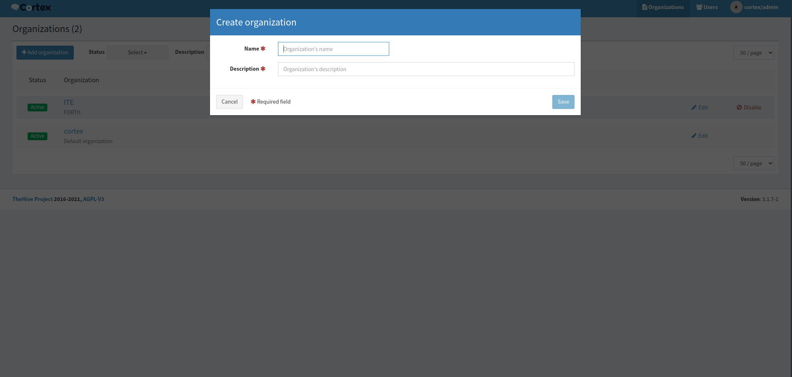
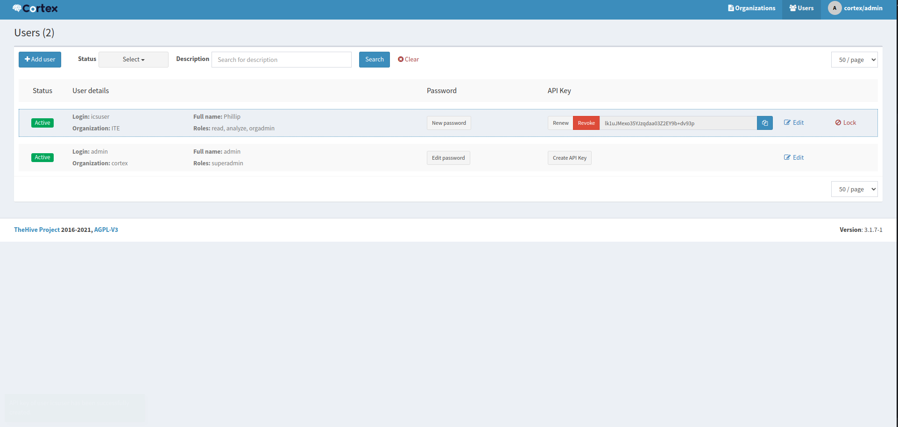
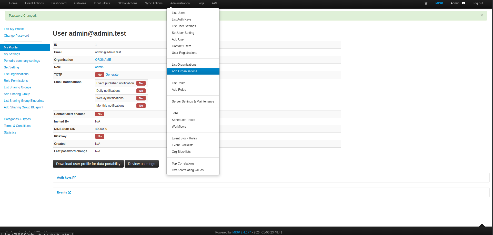
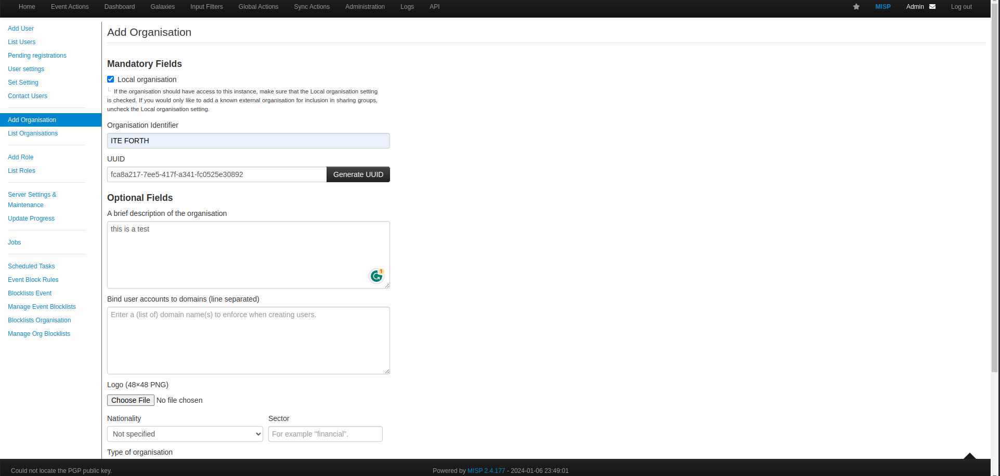
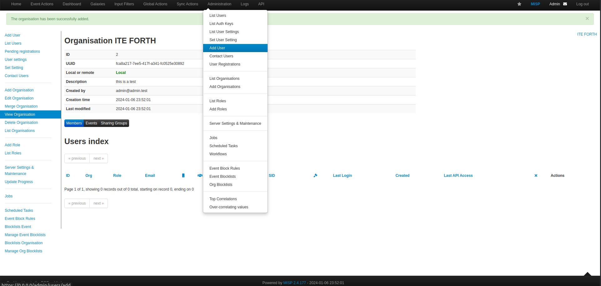
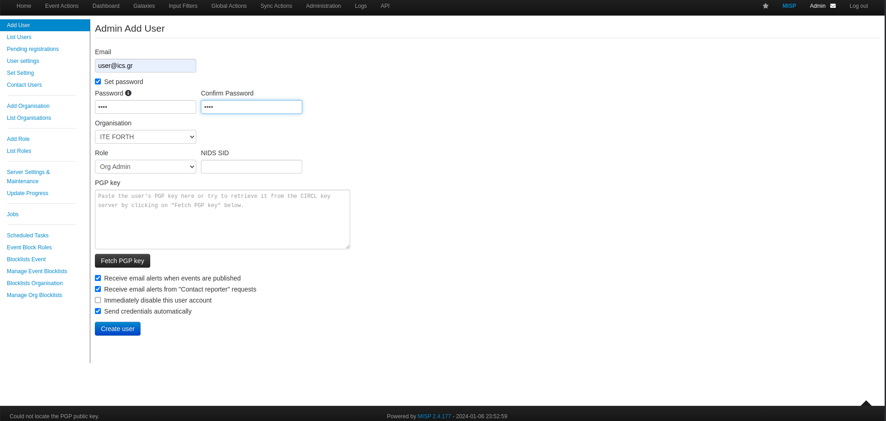
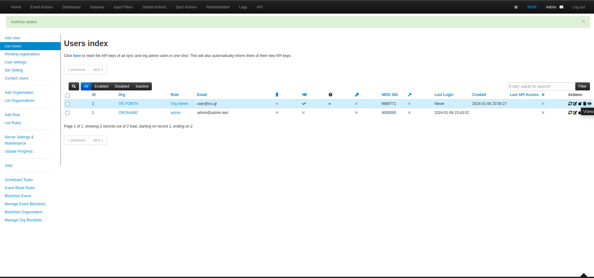
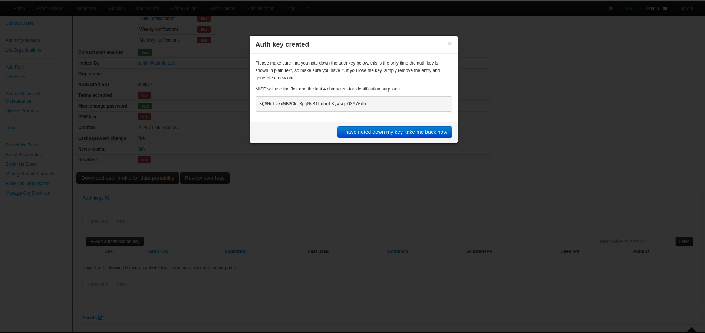
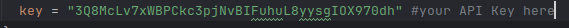

## Before  the installation of TheHive

We must generate API keys from both MISP and Cortex so we can connect them with our Incident Responce Tool.

## Cortex:

### 1. Login to   [Cortex](http://0.0.0.0:9001/) .

At the first  time setup the cortex will look like this:

Hit "update database" and you will be redirected to a sign-up form where you are supposed to create an admin user .

Now you can login with your credentials!!

### 2. Create an Organization

To create an Organization:

* Login to Cortex with your credentials

* In the organization panel click "Add Organizations".
  Enter the name and description of your organization and hit the "Save" button.

### 3. Create User for the Organization

* Navigate to the Users panel click  "Add User" and (1) set the Organization that we created at the step before ,
  (2) set the user roles as read,analyse,orgadmin.

Hit the "Save user" button.

#### Congratulation,now you have created your first Organization and orgAdmin in cortex.

### 4. Generate an API KEY for the user that we created below

* In the User panel,hit the "Create API KEY" and then "Reveal"
  

Copy the API key, go to the .env of the Folder ./Phase_3/.env and paste the key to the **CORTEX_APIKEY** field.

## MISP:

### 1. Login to   [MISP](https://0.0.0.0/users/login) with the MISP credentials given below .

At the first time of your login,you will be redirected to a change password page.Change your password and hit "Submit"

### 2. Create an Organization
To create an Organization go to Administration>Add Organizations

Fill the form :

and hit "Submit".

Now we need to create a User OrgAdmin.

### 3. Create User for the Organization

To create a User:

* Go to Administration>Add User

* Fill all the necesery field and (1) set the Organization that we created at the step before ,
  (2) set the user roles as Org Admin.

and hit "Create User".

#### Congratulation,now you have created your first Organization and orgAdmin in MISP.

### 4. Generate an API KEY for the user that we created below
In the List Users, find the User that we created below and in Actions press the last button  and you will be redirected at the user view.

At the end of the page, find the Button  Auth keys>Add authendication key  and submit an auth key for the user.

### 5. Add the MISP API key to the configuration of TheHive
Copy the API key and Paste it in configuration file   ./config/thehive.cof in the "key" field.

