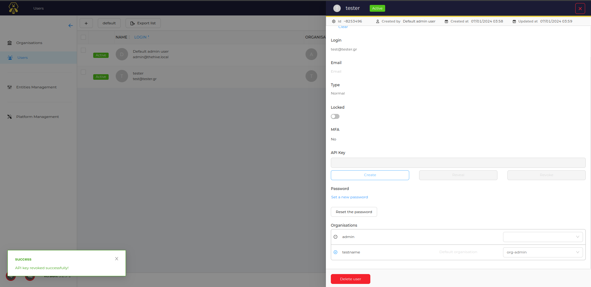

## Before  the installation of ElastAlert

We must generate API key from TheHive to connect it with ElastAlert.

### To generate an API key from a user in theHive we :

### 1. Create an Organization

To create an Organization:

* Login to TheHive 

* In the Menu panel click "Organizations" and press the "+" button 

Enter the name and description of your organization and hit the "Confirm" button.

### 3. Create User for the Organization

* In the Menu panel click "Users" and press the "+" button and (1) set the Organization that we created at the step before and role as org-admin ,
  (2) fill the other field and create user.

Hit the "Save user" button.

#### Congratulation,now you have created your first Organization and orgAdmin in cortex.

### 4. Generate an API KEY for the user that we created below

* In the User panel find the user that you created and hit the "preview" button and then at the API KEY Hit Create

Copy the API key, go to the rules.yaml of the Folder ./Phase_8/elastalert/rules.yaml and paste the key to the **hive_apikey** field.

